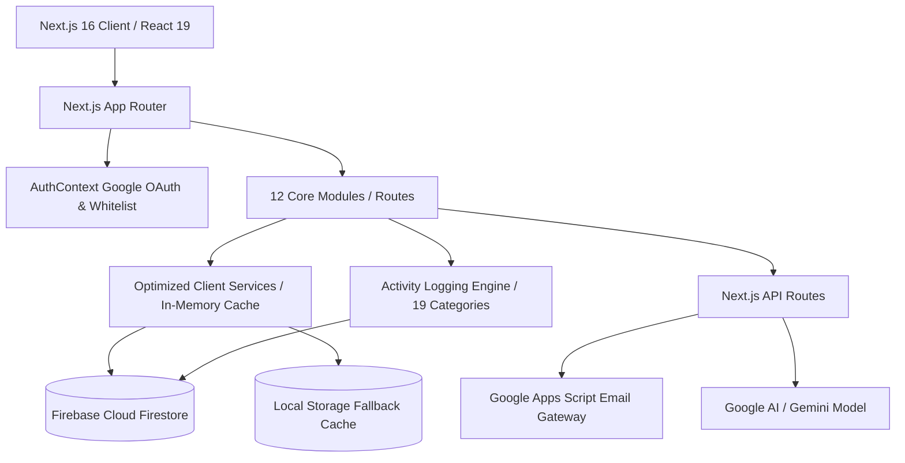

# 🏢 คู่มือและเอกสารสถาปัตยกรรมระบบ ICIT Workspace (Comprehensive System Specification & Architecture)
**สำนักคอมพิวเตอร์และเทคโนโลยีสารสนเทศ มหาวิทยาลัยเทคโนโลยีพระจอมเกล้าพระนครเหนือ (ICIT KMUTNB)**

---

## 📑 สารบัญ (Table of Contents)
1. [บทนำและภาพรวมระบบ (Executive Summary & Overview)](#1-บทนำและภาพรวมระบบ-executive-summary--overview)
2. [เทคโนโลยีและสถาปัตยกรรม (Tech Stack & Architecture)](#2-เทคโนโลยีและสถาปัตยกรรม-tech-stack--architecture)
3. [รายละเอียดฟังก์ชันทุกโมดูล (Complete Module Inventory)](#3-รายละเอียดฟังก์ชันทุกโมดูล-complete-module-inventory)
   - [3.1 Portal & Service Hub (หน้าหลักและพอร์ทัลบริการ)](#31-portal--service-hub-หน้าหลักและพอร์ทัลบริการ-)
   - [3.2 User Profile & Digital Identity (ข้อมูลส่วนตัวและสิทธิ์)](#32-user-profile--digital-identity-ข้อมูลส่วนตัวและสิทธิ์-profile)
   - [3.3 Organization & Executives (โครงสร้างองค์กรและผู้บริหาร)](#33-organization--executives-โครงสร้างองค์กรและผู้บริหาร-organization)
   - [3.4 Time & Attendance (บันทึกเวลา WFH/OT และ Workflow 4 ขั้นตอน)](#34-time--attendance-บันทึกเวลา-wfhot-และ-workflow-4-ขั้นตอน-time-attendance)
   - [3.5 Leave Management (ระบบบริหารจัดการวันลาและปฏิทิน)](#35-leave-management-ระบบบริหารจัดการวันลาและปฏิทิน-leave)
   - [3.6 JD Hub (แบบบรรยายลักษณะงานและสมรรถนะ)](#36-jd-hub-แบบบรรยายลักษณะงานและสมรรถนะ-jd-hub)
   - [3.7 IDP Hub (แผนพัฒนารายบุคคล Need Analysis & Action Plan)](#37-idp-hub-แผนพัฒนารายบุคคล-need-analysis--action-plan-idp-hub)
   - [3.8 Digital Skill Map (แผนที่ทักษะดิจิทัลและ AI Radar)](#38-digital-skill-map-แผนที่ทักษะดิจิทัลและ-ai-radar-skill-map)
   - [3.9 KM Hub (คลังความรู้และการอบรมมาตรฐาน)](#39-km-hub-คลังความรู้และการอบรมมาตรฐาน-km-hub)
   - [3.10 IMS Quality Hub (ระบบบริหารคุณภาพ ISO 9001 / ISO 27001 / ISO 20000-1)](#310-ims-quality-hub-ระบบบริหารคุณภาพ-iso-9001--iso-27001--iso-20000-1-ims)
   - [3.11 TQA Quality Hub (ระบบติดตาม OFI รางวัลคุณภาพแห่งชาติ)](#311-tqa-quality-hub-ระบบติดตาม-ofi-รางวัลคุณภาพแห่งชาติ-tqa)
   - [3.12 Admin Console & System Audit Logs (ระบบบริหารจัดการและประวัติกิจกรรม)](#312-admin-console--system-audit-logs-ระบบบริหารจัดการและประวัติกิจกรรม-admin)
4. [โครงสร้างฐานข้อมูล (Database Schema & Collections)](#4-โครงสร้างฐานข้อมูล-database-schema--collections)
5. [การรักษาความปลอดภัยและสิทธิ์การเข้าถึง (Security & RBAC)](#5-การรักษาความปลอดภัยและสิทธิ์การเข้าถึง-security--rbac)
6. [Serverless API & External Integrations (API และการเชื่อมต่อภายนอก)](#6-serverless-api--external-integrations-api-และการเชื่อมต่อภายนอก)
7. [คู่มือการติดตั้งและบำรุงรักษา (Deployment & Maintenance Guide)](#7-คู่มือการติดตั้งและบำรุงรักษา-deployment--maintenance-guide)

---

## 1. บทนำและภาพรวมระบบ (Executive Summary & Overview)

**ICIT Workspace** เป็นระบบดิจิทัลพอร์ทัลและแพลตฟอร์มบริหารจัดการองค์กรแบบบูรณาการ (Enterprise Digital Workspace & ERP-Light) ที่พัฒนาขึ้นสำหรับ **สำนักคอมพิวเตอร์และเทคโนโลยีสารสนเทศ มหาวิทยาลัยเทคโนโลยีพระจอมเกล้าพระนครเหนือ (ICIT KMUTNB)** โดยมีจุดมุ่งหมายเพื่อ:

1. **Digital Transformation**: รวมศูนย์บริการและระบบงานภายในไว้ในที่เดียว (Single Source of Truth)
2. **Workforce Development & Talent Management**: พัฒนาศักยภาพบุคลากรผ่านระบบ JD Hub, IDP Hub, Digital Skill Map และ KM Hub
3. **Quality & Compliance Assurance**: ขับเคลื่อนและติดตามมาตรฐานสากล ISO 9001:2015, ISO/IEC 27001:2022, ISO/IEC 20000-1:2018 และเกณฑ์คุณภาพแห่งชาติ (TQA)
4. **Audit Trail & Governance**: บันทึกและตรวจสอบประวัติการใช้งานทุกมิติแบบ Real-Time ตามหลักธรรมาภิบาลข้อมูลและ PDPA

---

## 2. เทคโนโลยีและสถาปัตยกรรม (Tech Stack & Architecture)



| Layer | เทคโนโลยี / เครื่องมือ | รายละเอียด |
| :--- | :--- | :--- |
| **Frontend Framework** | **Next.js 16.3.4 (App Router)** | React 19, Server & Client Components, Turbopack |
| **Styling & Design System** | **Vanilla CSS + Glassmorphism** | Theme Tokens, Responsive Grid, Smooth Animations, No Tailwind bloat |
| **Authentication** | **Firebase Authentication & Google OAuth** | Whitelist Enforcement, Organization Email Validation, Personnel Mapping |
| **Database** | **Firebase Cloud Firestore** | NoSQL Document Database, Real-time Snapshot Listeners, Security Rules |
| **Icons & UI Assets** | **Lucide React** | Feather-based lightweight scalable vector icons |
| **Email Gateway** | **Google Apps Script Webhook** | Server-side Email Dispatch, HTML Templates, Multi-step Approval Alerts |
| **AI Integration** | **Gemini 2.5 / 3.7 API** | Digital Skill Radar analysis & Development recommendations |

---

## 3. รายละเอียดฟังก์ชันทุกโมดูล (Complete Module Inventory)

### 3.1 Portal & Service Hub (หน้าหลักและพอร์ทัลบริการ: `/`)
- **Main Hero Banner**: ต้อนรับผู้ใช้งาน แสดงข้อมูลสรุปส่วนบุคคล วันที่ และทางลัดการใช้งาน
- **Service Cards Directory**: รายการการ์ดบริการดิจิทัลทั้งหมดของสำนักฯ จัดหมวดหมู่ พร้อมระบบค้นหาและเปิดใช้งานทันที
- **Personnel Quick Search**: ค้นหาบุคลากรสำนักฯ ตามชื่อ ฝ่ายงาน ตำแหน่ง หรือเบอร์โทรศัพท์ภายใน
- **Announcements & Broadcast**: ข่าวสาร ประชาสัมพันธ์ และกิจกรรมสำคัญของสำนักคอมพิวเตอร์ฯ
- **Direct Navigation Links**: เมนูลัดเข้าสู่ระบบย่อยทั้งหมด

### 3.2 User Profile & Digital Identity (ข้อมูลส่วนตัวและสิทธิ์: `/profile`)
- **Digital ID Card**: แสดงบัตรประจำตัวดิจิทัล, รูปถ่าย, ชื่อภาษาไทย/อังกฤษ, ตำแหน่ง, ฝ่ายงาน และสถานะการปฏิบัติงาน
- **Assigned Job Description (JD)**: ดูรายละเอียดภาระงาน JD ที่ได้รับมอบหมาย พร้อมสถานะการกดรับทราบ (Confirmed)
- **IDP & Competency Summary**: สรุปผลการประเมินสมรรถนะและ Action Plan ล่าสุด
- **Leave Balance & Quota**: สรุปโควตาวันลาคงเหลือ สถิติการลาแต่ละประเภท และประวัติการลา
- **Time & Attendance Summary**: ประวัติการขอลงเวลา WFH และทำงานล่วงเวลา (OT)

### 3.3 Organization & Executives (โครงสร้างองค์กรและผู้บริหาร: `/organization`)
- **Executive Board Directory**: แสดงทำเนียบผู้บริหาร ผู้อำนวยการสำนักฯ และรองผู้อำนวยการแต่ละฝ่าย
- **Organizational Structure**: แผนผังโครงสร้างการบริหารงาน ภารกิจหลัก และรายชื่อหัวหน้าฝ่าย
- **Department Personnel Roster**: รายชื่อบุคลากรประจำแต่ละฝ่ายงาน พร้อมช่องทางติดต่อภายใน

### 3.4 Time & Attendance (บันทึกเวลา WFH/OT และ Workflow 4 ขั้นตอน: `/time-attendance`)
- **Clock-In / WFH / OT Request**: ยื่นคำขอลงเวลาย้อนหลัง, ปฏิบัติงานนอกสถานที่ (WFH), หรือทำงานล่วงเวลา (OT)
- **4-Step Approval Workflow Engine**:
  1. *เจ้าหน้าที่ผู้ยื่นคำขอ (Applicant)*
  2. *พยาน / ผู้ร่วมปฏิบัติงาน (Witness)*
  3. *หัวหน้าฝ่ายงาน (Department Head)*
  4. *รองผู้อำนวยการ / ผู้อำนวยการสำนักฯ (Executive)*
- **Automated Email Notifications**: แจ้งเตือนผู้มีอำนาจอนุมัติในแต่ละระดับผ่านอีเมลอัตโนมัติ
- **Monthly Summary & Status Tracking**: สรุปจำนวนชั่วโมง OT, วัน WFH, และปฏิทินการปฏิบัติงานรายบุคคล

### 3.5 Leave Management (ระบบบริหารจัดการวันลาและปฏิทิน: `/leave`)
- **Leave Request Submission**: ยื่นใบลาออนไลน์ (ลาพักผ่อน, ลากิจ, ลาป่วย, ลาคลอด, ลาอุปสมบท ฯลฯ)
- **Automatic Quota Deduction**: คำนวณวันลาคงเหลืออัตโนมัติตามประเภทและปีงบประมาณ
- **Interactive Leave Calendar**: ปฏิทินวันลาส่วนกลาง แสดงสถานะวันลาของบุคลากรในสำนักฯ แบบเรียลไทม์
- **Approval Workflow**: หัวหน้าฝ่ายงานและผู้บริหารตรวจสอบและอนุมัติใบลา

### 3.6 JD Hub (แบบบรรยายลักษณะงานและสมรรถนะ: `/jd-hub`)
- **Job Description Repository**: คลังแบบบรรยายลักษณะงานมาตรฐานของทุกตำแหน่งในสำนักฯ
- **Required Qualifications & Standards**:
  - วุฒิการศึกษาและประสบการณ์
  - **ทักษะภาษาอังกฤษ (English Proficiency)**: กำหนดมาตรฐานเริ่มต้นที่ *ระดับเริ่มต้น หรือ CEFR ไม่ต่ำกว่า B1*
  - ทักษะดิจิทัลและเครื่องมือที่ต้องใช้ในการปฏิบัติงาน
- **Digital Confirmation Workflow**: บุคลากรกดปุ่มยืนยันรับทราบ JD ประจำปี พร้อมระบบบันทึก Audit Trail
- **Window Configuration**: ผู้ดูแลระบบกำหนดช่วงเวลาเปิด-ปิดการปรับปรุง JD ประจำปีงบประมาณ

### 3.7 IDP Hub (แผนพัฒนารายบุคคล: `/idp-hub`, `/idp-hub/need-analysis`, `/idp-hub/action-plan`)
- **Individual Development Plan (IDP)**: ประเมินสมรรถนะหลัก (Core Competency) และสมรรถนะตามสายงาน (Functional Competency)
- **Need Analysis Matrix**: วิเคราะห์ช่องว่างความรู้และทักษะ (Skill Gaps) เทียบกับระดับเป้าหมายที่คาดหวัง
- **4-Quarter Action Plan**: จัดทำแผนพัฒนาตนเอง 4 ไตรมาส (อบรม, OJT, แลกเปลี่ยนเรียนรู้, ศึกษาดูงาน)
- **Strategic OKRs Alignment**: เชื่อมโยงแผนพัฒนาบุคลากรเข้ากับเป้าหมายยุทธศาสตร์ของสำนักฯ

### 3.8 Digital Skill Map (แผนที่ทักษะดิจิทัลและ AI Radar: `/skill-map`)
- **4 Work Group Assessments**: แบบประเมินทักษะดิจิทัล 4 กลุ่มงาน (วิชาการคอมพิวเตอร์, วิศวกรรม, บริหารงานทั่วไป, บริการเทคโนโลยี)
- **Skill Proficiency Levels (0-5)**: ประเมินระดับความเชี่ยวชาญตั้งแต่ระดับ 0 (ไม่มีทักษะ) ถึงระดับ 5 (ผู้เชี่ยวชาญ/ถ่ายทอดได้)
- **Interactive Radar Chart**: กราฟเรดาร์แสดงจุดแข็งและจุดที่ต้องพัฒนา
- **AI Skill Analysis (`/api/skill-map/ai-analyze`)**: วิเคราะห์ผลและแนะนำคอร์สอบรมที่เหมาะสมผ่าน AI
- **Fiscal Year Cloning**: คัดลอกและปรับโครงสร้างเกณฑ์ทักษะข้ามปีงบประมาณ

### 3.9 KM Hub (คลังความรู้และการอบรมมาตรฐาน: `/km-hub`)
- **Knowledge Asset Repository**: คลังรวบรวมองค์ความรู้ งานวิจัย คู่มือปฏิบัติงาน และสรุปการฝึกอบรม
- **Document Guidelines & Form Templates**: ระบบจัดการแบบฟอร์มเอกสาร KM สำหรับบุคลากร
- **Categorized Search**: ค้นหาตามหมวดหมู่ คำสำคัญ ฝ่ายงาน และปีงบประมาณ
- **Approval & Publication**: ตรวจสอบความถูกต้องของบทความก่อนเผยแพร่สู่สาธารณะ

### 3.10 IMS Quality Hub (ระบบบริหารคุณภาพสากล: `/ims`, `/ims/audit`, `/ims/car-incident`, `/ims/ofi-hub`)
- **Integrated Standards Dashboard**: ติดตามสถานะ 3 มาตรฐานสากล:
  - *ISO 9001:2015* (ระบบบริหารงานคุณภาพ)
  - *ISO/IEC 27001:2022* (ระบบบริหารความมั่นคงปลอดภัยสารสนเทศ)
  - *ISO/IEC 20000-1:2018* (ระบบบริหารจัดการบริการสารสนเทศ)
- **Internal Audit Module (`/ims/audit`)**: บันทึกแผนการตรวจประเมิน กำหนดการ และผลการตรวจติดตามภายใน
- **CAR & Incident Management (`/ims/car-incident`)**: ออกใบคำขอแก้ไขข้อบกพร่อง (CAR) และจัดการอุบัติการณ์ความปลอดภัย
- **Opportunity for Improvement (OFI Hub) (`/ims/ofi-hub`)**: บันทึกและติดตามข้อเสนอแนะเพื่อการปรับปรุงระบบอย่างต่อเนื่อง

### 3.11 TQA Quality Hub (ระบบติดตาม OFI รางวัลคุณภาพแห่งชาติ: `/tqa`, `/tqa/ofi-tracking`)
- **7 TQA Categories Tracking**: ติดตามการดำเนินงานปรับปรุงตามหมวด 1-7 ของเกณฑ์รางวัลคุณภาพแห่งชาติ (TQA)
- **3-Round Progress Monitoring**: บันทึกและประเมินผลการดำเนินงาน 3 รอบ (รอบ 3 เดือน, 6 เดือน, 9 เดือน)
- **Feedback Report Management**: จัดเก็บและแนบเอกสาร Feedback Report และหลักฐานประกอบ

### 3.12 Admin Console & System Audit Logs (ระบบบริหารจัดการและประวัติกิจกรรม: `/admin`)
- **Personnel Directory Administration**: เพิ่ม ลบ แก้ไข ข้อมูลบุคลากร กำหนดบทบาท (Admin, User) และสถานะการลาออก
- **Department & Executive Hierarchy Management**: ปรับแต่งฝ่ายงาน ลากจัดเรียงลำดับผู้บริหาร (Drag & Drop)
- **Portal Link Customization**: จัดการการ์ดบริการและลิงก์ภายนอกบนหน้าแรก
- **Audit Trail & Activity Log Engine (19 หมวดหมู่)**:
  - **Dynamic KPI Dashboard**: การ์ดสถิติ 7 มิติหลักที่คำนวณสดตามช่วงเวลา
  - **Custom Date Range Filter Modal**: กรองประวัติตามช่วงเวลายอดนิยม หรือระบุวันที่เริ่มต้น-สิ้นสุดอิสระ
  - **Refined Data Table**: ตารางแสดงหมวดหมู่, กิจกรรม, ข้อมูลเป้าหมาย (Target Entity), ผู้ดำเนินการ, และวัน-เวลา
  - **Multi-Format Export**: ส่งออกไฟล์ **CSV** (พร้อม UTF-8 BOM สำหรับภาษาไทยใน Excel) และ **JSON**
  - **Log Inspector Modal**: ดู JSON Payload และ Metadata เชิงลึก

---

## 4. โครงสร้างฐานข้อมูล (Database Schema & Collections)

ระบบใช้ **Google Cloud Firestore** เป็นฐานข้อมูลหลัก ประกอบด้วย 26 คอลเลกชัน:

| คอลเลกชัน (Collection) | วัตถุประสงค์ (Purpose) | เอกสารหลัก / Key Fields |
| :--- | :--- | :--- |
| `personnels` | ข้อมูลบุคลากรทั้งหมด | `id, name, email, role, department, position, status, phone` |
| `executives` | ทำเนียบผู้บริหารสำนักฯ | `id, name, position, role, order, image, email` |
| `departments` | โครงสร้างฝ่ายงานและภารกิจ | `id, name, head, description, missions, order` |
| `portal_cards` | การ์ดบริการดิจิทัลหน้า Portal | `id, title, description, url, icon, category, order, isExternal` |
| `time_attendance_records` | บันทึกการลงเวลา WFH/OT | `id, applicant, witness, approver, status, steps, hours, dates` |
| `time_attendance_configs` | การตั้งค่ารอบการขอลงเวลา | `fiscalYear, isOpen, deadline, rules` |
| `leave_records` | ประวัติการยื่นใบลา | `id, personnelEmail, leaveType, startDate, endDate, days, status` |
| `leave_quotas` | สิทธิ์และโควตาวันลาประจำปี | `personnelEmail_year, annualQuota, carriedOver, used, balance` |
| `jd_records` | แบบบรรยายลักษณะงาน (JD) | `id, title, department, qualifications, duties, confirmedBy, status` |
| `jd_configs` | การตั้งค่ารอบการกรอก JD | `fiscalYear, isOpen, startDate, endDate` |
| `idp_records` | ผลการประเมินสมรรถนะ IDP | `id, personnelEmail, fiscalYear, coreScores, functionalScores, status` |
| `idp_configs` | เกณฑ์สมรรถนะ Core & Functional | `fiscalYear, coreCompetencies, functionalCompetencies` |
| `idp_strategy_configs` | ยุทธศาสตร์และ OKRs องค์กร | `fiscalYear, strategies, okrs, strategicGoals` |
| `idp_action_plans` | แผนปฏิบัติการพัฒนา 4 ไตรมาส | `id, personnelEmail, fiscalYear, goals, activities, quarters, status` |
| `skill_map_assessments` | แบบประเมินทักษะดิจิทัล | `id, personnelEmail, fiscalYear, groupKey, skillScores, radarData` |
| `skill_map_configs` | โครงสร้างเกณฑ์ทักษะดิจิทัล | `fiscalYear, groups, skills, levelDefinitions` |
| `km_records` | องค์ความรู้และการฝึกอบรม | `id, title, category, author, content, attachments, status` |
| `km_doc_configs` | คู่มือและแบบฟอร์มเอกสาร KM | `id, formName, templateDoc, guidelines, updatedAt` |
| `ims_audits` | การตรวจติดตามภายใน IMS | `id, standard, auditDate, auditor, department, findings, status` |
| `ims_cars` | ใบคำขอแก้ไขข้อบกพร่อง (CAR) | `id, carNumber, standard, issueDescription, rootCause, actionPlan, status` |
| `ims_ofis` | ข้อเสนอแนะปรับปรุง IMS (OFI) | `id, standard, department, proposal, implementation, status` |
| `tqa_ofis` | การติดตาม OFI รางวัลคุณภาพ TQA | `id, category, subCategory, round1, round2, round3, status, reportUrl` |
| `tqa_report_configs` | การตั้งค่า Feedback Report TQA | `fiscalYear, reportFile, evaluationCriteria` |
| `activity_logs` | ประวัติกิจกรรมและ Audit Trail | `id, category, action, title, details, actor, target, metadata, loggedAt` |
| `email_logs` | ประวัติการส่งอีเมลแจ้งเตือน | `id, to, subject, template, status, triggeredBy, sentAt` |
| `system_configs` | การตั้งค่าระบบและความปลอดภัย | `key, value, updatedAt, updatedBy` |

---

## 5. การรักษาความปลอดภัยและสิทธิ์การเข้าถึง (Security & RBAC)

### 5.1 ระบบการยืนยันตัวตน (Authentication)
- ล็อกอินด้วยบัญชีอีเมลสถาบัน **Google Workspace (`@cit.kmutnb.ac.th` หรือ `@kmutnb.ac.th`)**
- ระบบตรวจสอบ **Whitelist บุคลากร**: หากไม่มีชื่อในฐานข้อมูล `personnels` หรือมีสถานะ "ลาออก (Resigned)" ระบบจะไม่อนุญาตให้เข้าใช้งาน และบันทึกกิจกรรม `LOGIN_REJECTED` ลง Audit Trail ทันที

### 5.2 ระดับสิทธิ์การใช้งาน (Role-Based Access Control)
1. **General User (บุคลากรทั่วไป)**:
   - ดูข้อมูลและสิทธิ์ส่วนบุคคล, ยื่นคำขอลงเวลา/วันลา, ประเมิน IDP และ Skill Map, ยืนยัน JD ของตนเอง, อ่านและส่งบทความ KM
2. **Approver / Head of Department (หัวหน้าฝ่ายงาน)**:
   - ตรวจสอบและอนุมัติคำขอลงเวลา WFH/OT, อนุมัติวันลา, ประเมิน IDP บุคลากรในฝ่ายงาน
3. **Executive / Director (ผู้บริหารสำนักฯ)**:
   - อนุมัติคำขอในขั้นตอนสุดท้าย, ดู Dashboard ภาพรวมทุกมิติ, ติดตาม TQA และ IMS
4. **Administrator (ผู้ดูแลระบบ)**:
   - จัดการบุคลากร, ปรับแต่งฝ่ายงาน, จัดเรียงผู้บริหาร, ตั้งค่ารอบเวลา, ตรวจสอบ Audit Trail และส่งออกข้อมูล

### 5.3 Firestore Security Rules (`firestore.rules`)
```javascript
rules_version = '2';
service cloud.firestore {
  match /databases/{database}/documents {
    
    // Helper Functions
    function isAuthenticated() {
      return request.auth != null;
    }
    function getUserEmail() {
      return request.auth.token.email.lower();
    }
    function isAdmin() {
      return isAuthenticated() && (
        getUserEmail() in ['tiawongsombat@gmail.com', 'prasertsak.t@cit.kmutnb.ac.th'] ||
        request.auth.token.role == 'admin'
      );
    }

    // Activity & Audit Logs
    match /activity_logs/{logId} {
      allow read: if true;
      allow create: if true; // อนุญาตให้บันทึก login failure / page views
      allow update, delete: if isAdmin();
    }

    // Personnel & Master Data
    match /personnels/{id} {
      allow read: if true;
      allow write: if isAdmin();
    }

    // Other core collections...
    match /{document=**} {
      allow read, write: if isAuthenticated();
    }
  }
}
```

---

## 6. Serverless API & External Integrations

### 6.1 Email Gateway Service (`/api/email/send`, `/api/attendance/notify`)
- เชื่อมต่อไปยัง **Google Apps Script Webhook** เพื่อส่งอีเมลแจ้งเตือนผ่านโครงสร้างพื้นฐานของ Google Workspace โดยไม่ต้องพึ่งพา SMTP ภายนอก
- รองรับการส่งอีเมล HTML Template สวยงาม พร้อมปุ่มกดอนุมัติคำขอโดยตรง

### 6.2 AI Skill Assessment (`/api/skill-map/ai-analyze`)
- รับข้อมูลคะแนนทักษะดิจิทัลของบุคลากร ส่งไปยัง Google AI API (Gemini) เพื่อวิเคราะห์จุดเด่น จุดที่ควรเสริม และแนะนำหลักสูตรการเรียนรู้ที่เหมาะสม

---

## 7. คู่มือการติดตั้งและบำรุงรักษา (Deployment & Maintenance Guide)

### 7.1 ข้อกำหนดของระบบ (Prerequisites)
- **Node.js**: เวอร์ชัน `>= 20.x`
- **NPM**: เวอร์ชัน `>= 10.x`
- **Firebase Project**: บัญชี Google Cloud / Firebase ที่เปิดใช้งาน Firestore และ Firebase Auth

### 7.2 การตั้งค่า Environment Variables (`.env.local`)
```env
NEXT_PUBLIC_FIREBASE_API_KEY=your_api_key
NEXT_PUBLIC_FIREBASE_AUTH_DOMAIN=your_project.firebaseapp.com
NEXT_PUBLIC_FIREBASE_PROJECT_ID=your_project_id
NEXT_PUBLIC_FIREBASE_STORAGE_BUCKET=your_project.appspot.com
NEXT_PUBLIC_FIREBASE_MESSAGING_SENDER_ID=your_sender_id
NEXT_PUBLIC_FIREBASE_APP_ID=your_app_id
GAS_EMAIL_WEBHOOK_URL=https://script.google.com/macros/s/.../exec
```

### 7.3 การรันคำสั่งในการพัฒนาและ Build
```bash
# 1. ติดตั้ง Dependencies
npm install

# 2. รัน Local Development Server
npm run dev

# 3. ตรวจสอบการ Build สำหรับ Production
npm run build

# 4. Deploy Firestore Security Rules
firebase deploy --only firestore:rules
```

---

*เอกสารฉบับนี้จัดทำขึ้นสำหรับโครงการพัฒนาระบบสารสนเทศ ICIT Workspace โดย สำนักคอมพิวเตอร์และเทคโนโลยีสารสนเทศ มจพ.*
