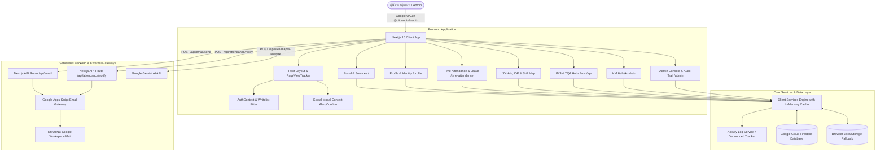

# 🏢 คู่มือและเอกสารสถาปัตยกรรมระบบ ICIT Workspace ฉบับสมบูรณ์ (Comprehensive Enterprise Specification & Architecture)
**สำนักคอมพิวเตอร์และเทคโนโลยีสารสนเทศ มหาวิทยาลัยเทคโนโลยีพระจอมเกล้าพระนครเหนือ (ICIT KMUTNB)**

---

## 📑 สารบัญ (Table of Contents)
1. [บทนำและวิสัยทัศน์ระบบ (Executive Summary & Vision)](#1-บทนำและวิสัยทัศน์ระบบ-executive-summary--vision)
2. [สถาปัตยกรรมเชิงเทคนิค (Technical Architecture & Technology Stack)](#2-สถาปัตยกรรมเชิงเทคนิค-technical-architecture--technology-stack)
3. [โครงสร้างหน้าจอและโมดูลระบบทั้งหมด (Complete Module & Route Specifications)](#3-โครงสร้างหน้าจอและโมดูลระบบทั้งหมด-complete-module--route-specifications)
   - [3.1 พอร์ทัลกลางและศูนย์บริการดิจิทัล (Portal & Service Hub: `/`)](#31-พอร์ทัลกลางและศูนย์บริการดิจิทัล-portal--service-hub-)
   - [3.2 ข้อมูลส่วนตัวและตัวตนดิจิทัล (User Profile & Identity: `/profile`)](#32-ข้อมูลส่วนตัวและตัวตนดิจิทัล-user-profile--identity-profile)
   - [3.3 โครงสร้างองค์กรและทำเนียบผู้บริหาร (Organization & Executives: `/organization`)](#33-โครงสร้างองค์กรและทำเนียบผู้บริหาร-organization--executives-organization)
   - [3.4 ระบบบันทึกเวลาปฏิบัติงานและคำขอ WFH/OT (Time & Attendance: `/time-attendance`)](#34-ระบบบันทึกเวลาปฏิบัติงานและคำขอ-wfhot-time--attendance-time-attendance)
   - [3.5 ระบบบริหารจัดการวันลาและปฏิทินกลาง (Leave Management & Quota: `/leave`)](#35-ระบบบริหารจัดการวันลาและปฏิทินกลาง-leave-management--quota-leave)
   - [3.6 ศูนย์จัดการแบบบรรยายลักษณะงาน (JD Hub: `/jd-hub`)](#36-ศูนย์จัดการแบบบรรยายลักษณะงาน-jd-hub-jd-hub)
   - [3.7 แผนพัฒนารายบุคคลและการวิเคราะห์ช่องว่างทักษะ (IDP Hub: `/idp-hub`)](#37-แผนพัฒนารายบุคคลและการวิเคราะห์ช่องว่างทักษะ-idp-hub-idp-hub)
     - *3.7.1 การประเมินสมรรถนะ Core & Functional Competency*
     - *3.7.2 เมทริกซ์วิเคราะห์ความต้องการพัฒนา (Need Analysis: `/idp-hub/need-analysis`)*
     - *3.7.3 แผนปฏิบัติการพัฒนา 4 ไตรมาส (4-Quarter Action Plan: `/idp-hub/action-plan`)*
     - *3.7.4 การเชื่อมโยงยุทธศาสตร์องค์กรและ OKRs (Strategic Alignment)*
   - [3.8 แผนที่ทักษะดิจิทัลและการวิเคราะห์ด้วย AI (Digital Skill Map: `/skill-map`)](#38-แผนที่ทักษะดิจิทัลและการวิเคราะห์ด้วย-ai-digital-skill-map-skill-map)
   - [3.9 ศูนย์จัดการความรู้และการอบรม (KM Hub: `/km-hub`)](#39-ศูนย์จัดการความรู้และการอบรม-km-hub-km-hub)
   - [3.10 ศูนย์บริหารคุณภาพมาตรฐานสากล (IMS Quality Hub: `/ims`)](#310-ศูนย์บริหารคุณภาพมาตรฐานสากล-ims-quality-hub-ims)
     - *3.10.1 การตรวจติดตามภายใน (Internal Audit: `/ims/audit`)*
     - *3.10.2 การจัดการข้อบกพร่องและอุบัติการณ์ (CAR & Incident: `/ims/car-incident`)*
     - *3.10.3 ข้อเสนอแนะเพื่อการปรับปรุงระบบ (OFI Hub: `/ims/ofi-hub`)*
   - [3.11 ศูนย์ติดตามผลการดำเนินงานรางวัลคุณภาพแห่งชาติ (TQA Hub: `/tqa`)](#311-ศูนย์ติดตามผลการดำเนินงานรางวัลคุณภาพแห่งชาติ-tqa-hub-tqa)
   - [3.12 ศูนย์ควบคุมสำหรับผู้ดูแลระบบและระบบตรวจสอบย้อนหลัง (Admin Console & Audit Trail: `/admin`)](#312-ศูนย์ควบคุมสำหรับผู้ดูแลระบบและระบบตรวจสอบย้อนหลัง-admin-console--audit-trail-admin)
4. [โครงสร้างฐานข้อมูล Cloud Firestore (Database Schema & Collections)](#4-โครงสร้างฐานข้อมูล-cloud-firestore-database-schema--collections)
5. [ระบบความมั่นคงปลอดภัยและการควบคุมสิทธิ์ (Security & Role-Based Access Control)](#5-ระบบความมั่นคงปลอดภัยและการควบคุมสิทธิ์-security--role-based-access-control)
6. [สถาปัตยกรรม Serverless API และบริการภายนอก (APIs & Integrations)](#6-สถาปัตยกรรม-serverless-api-และบริการภายนอก-apis--integrations)
7. [การเพิ่มประสิทธิภาพและการจัดเก็บข้อมูลแคช (Performance & In-Memory Caching)](#7-การเพิ่มประสิทธิภาพและการจัดเก็บข้อมูลแคช-performance--in-memory-caching)
8. [คู่มือการติดตั้ง ใช้งาน และบำรุงรักษาระบบ (Deployment & Operations Guide)](#8-คู่มือการติดตั้ง-ใช้งาน-และบำรุงรักษาระบบ-deployment--operations-guide)

---

## 1. บทนำและวิสัยทัศน์ระบบ (Executive Summary & Vision)

**ICIT Workspace** ได้รับการพัฒนาขึ้นเพื่อเป็นแพลตฟอร์มดิจิทัลระดับองค์กร (Integrated Digital Workspace & Lightweight Enterprise Resource Planning) สำหรับ **สำนักคอมพิวเตอร์และเทคโนโลยีสารสนเทศ มหาวิทยาลัยเทคโนโลยีพระจอมเกล้าพระนครเหนือ (ICIT KMUTNB)** โดยรวมศูนย์กระบวนการทำงานหลัก 4 มิติเข้าไว้ด้วยกันอย่างไร้รอยต่อ:

```
┌────────────────────────────────────────────────────────────────────────┐
│                          ICIT WORKSPACE PLATFORM                       │
├───────────────────┬────────────────────┬───────────────────┬───────────┤
│ 1. บริการองค์กร   │ 2. พัฒนาทรัพยากร   │ 3. คุณภาพมาตรฐาน  │ 4. ธรรมา  │
│    (Portal & Ops) │    มนุษย์ (HRD)    │    สากล (Quality) │    ภิบาล  │
│ • Single Sign-On  │ • JD Hub & CEFR B1 │ • ISO 9001:2015   │ • Audit   │
│ • WFH/OT 4 ขั้นตอน│ • IDP Need Analysis│ • ISO 27001:2022  │   Logs 19 │
│ • ระบบใบลาและโควตา│ • 4-Q Action Plan  │ • TQA 7 หมวด      │   หมวดหมู่│
│ • บัตรดิจิทัล     │ • AI Skill Radar   │ • CAR & OFI Hub   │ • PDPA    │
│ • โครงสร้างฝ่ายงาน│ • KM & อบรม        │ • Internal Audit  │ • Reports │
└───────────────────┴────────────────────┴───────────────────┴───────────┘
```

---

## 2. สถาปัตยกรรมเชิงเทคนิค (Technical Architecture & Technology Stack)

### 2.1 สถาปัตยกรรมภาพรวม (System Architecture)



### 2.2 เทคโนโลยีหลัก (Core Stack)
- **Framework**: Next.js 16.3.4 (App Router Architecture, React 19, Turbopack)
- **UI & Styling System**: Custom Vanilla CSS พร้อม Glassmorphism Token Architecture (ปราศจากความซับซ้อนและข้อจำกัดของ Tailwind)
- **Icons**: Lucide React (ไอคอนมาตรฐาน Feather-based สำหรับ Enterprise UI)
- **Database Engine**: Firebase Cloud Firestore (NoSQL, Real-time Snapshot Synchronization)
- **Authentication**: Firebase Authentication เชื่อมต่อ Google Workspace OAuth
- **AI Integration**: Google Gemini AI API สำหรับการประเมินทักษะดิจิทัลและแนะนำแผนพัฒนา
- **Email Gateway**: Google Apps Script Webhook สำหรับการส่งอีเมลแจ้งเตือน Workflow และใบเตือน CAR

---

## 3. โครงสร้างหน้าจอและโมดูลระบบทั้งหมด (Complete Module & Route Specifications)

### 3.1 พอร์ทัลกลางและศูนย์บริการดิจิทัล (Portal & Service Hub: `/`)
- **Hero Identity Card**: การ์ดแสดงข้อมูลผู้ใช้ สังกัดฝ่ายงาน วันที่ และสถิติด่วน
- **Directory Service Cards**: คลังการ์ดบริการดิจิทัลของสำนักฯ แบ่งหมวดหมู่ (ระบบบริการสารสนเทศ, บริการเครือข่าย, ระบบบริหารงานบุคคล, คุณภาพและการเรียนรู้) รองรับทั้งลิงก์ภายในและภายนอก
- **Personnel Fast Finder**: ค้นหารายชื่อบุคลากรสำนักฯ แสดงตำแหน่ง, ฝ่ายงาน, เบอร์โทรศัพท์ภายใน, และอีเมล
- **Announcements & Banner Feed**: ประกาศและข่าวสารสำคัญภายในสำนักฯ

### 3.2 ข้อมูลส่วนตัวและตัวตนดิจิทัล (User Profile & Identity: `/profile`)
- **Digital Employee ID**: บัตรประจำตัวบุคลากรดิจิทัล แสดงรูปถ่าย, ตำแหน่ง, รหัสประจำตัว, ฝ่ายงาน, และ QR สำหรับติดต่อ
- **Assigned Job Description (JD)**: ดูรายละเอียดแบบบรรยายลักษณะงานที่ได้รับมอบหมาย พร้อมสถานะการกดรับทราบ (Confirmed / Pending)
- **Personal IDP & Competency**: สรุปคะแนนการประเมินสมรรถนะตนเองและหัวหน้างาน พร้อมสถานะ Action Plan
- **Leave Balance Dashboard**: สถิติโควตาวันลาคงเหลือประจำปีงบประมาณ แยกตามประเภทวันลา
- **Attendance History Log**: ประวัติการขอลงเวลา WFH และการทำงานล่วงเวลา (OT)

### 3.3 โครงสร้างองค์กรและทำเนียบผู้บริหาร (Organization & Executives: `/organization`)
- **Executive Board Directorate**: ทำเนียบผู้บริหาร ผู้อำนวยการสำนักฯ และรองผู้อำนวยการ พร้อมตำแหน่งหน้าที่และช่องทางติดต่อ
- **Organizational Structure (โครงสร้าง 6 ฝ่ายหลัก)**:
  - 1. *สำนักงานผู้อำนวยการ*
  - 2. *ฝ่ายวิศวกรรมระบบเครือข่าย*
  - 3. *ฝ่ายบริการวิชาการและส่งเสริมการวิจัย*
  - 4. *ฝ่ายพัฒนาระบบสารสนเทศ*
  - 5. *ฝ่ายเทคโนโลยีสารสนเทศ วิทยาเขตปราจีนบุรี*
  - 6. *ฝ่ายเทคโนโลยีสารสนเทศ วิทยาเขตระยอง*
- **Department Roster & Supervision Details**: แสดงข้อมูลภารกิจหน้าที่, ผู้บริหารที่กำกับดูแลฝ่าย (Supervising Executive), หัวหน้าฝ่ายงาน (Head of Department), และรายนามบุคลากรประจำฝ่าย

### 3.4 ระบบบันทึกเวลาปฏิบัติงานและคำขอ WFH/OT (Time & Attendance: `/time-attendance`)
- **คำขอปฏิบัติงาน (Request Submission)**: ขอลงเวลาย้อนหลัง (มา/กลับปฏิบัติราชการ), ปฏิบัติงานนอกสถานที่ (WFH), และปฏิบัติงานนอกเวลาทำการ (OT)
- **เกณฑ์การขอลงเวลาปฏิบัติราชการ (Time Attendance Quota)**:
  - กำหนดเกณฑ์เพดานการขอลงเวลา **ไม่เกินจำนวน 12 ครั้ง ใน 1 ปีงบประมาณ** (คำนวณตามรอบปีงบประมาณจริง 1 ต.ค. - 30 ก.ย.)
  - แถบติดตามสถิติและโควตารายบุคคล (Individual Quota Tracker Banner) พร้อม Progress Bar และระบบแจ้งเตือนเมื่อใกล้ครบเกณฑ์ (⚠️ Near Limit $\ge 80\%$ หรือ $\ge 10$ ครั้ง) และเมื่อครบเกณฑ์/เกินเกณฑ์ (🚨 Exceeded $\ge 12$ ครั้ง)
  - แดชบอร์ดตรวจสอบโควตาสำหรับ HR และผู้บริหาร (Time Attendance Quota Overview Modal) สำหรับกำกับดูแลและตรวจสอบรายชื่อบุคลากรที่แตะเพดานการขอลงเวลา
  - การ์ดแจ้งเตือนโควตาคงเหลือภายในฟอร์มยื่นคำขอลงเวลา (Real-Time Quota Status Card)
- **Workflow อนุมัติ 4 ขั้นตอน (4-Step Verification Workflow)**:
  1. *เจ้าหน้าที่ผู้ยื่นคำขอ (Applicant Submission)*
  2. *พยานร่วมปฏิบัติงาน (Witness Confirmation)*
  3. *หัวหน้าฝ่ายงาน (Department Head Approval)*
  4. *รองผู้อำนวยการ / ผู้อำนวยการ (Executive Final Approval)*
- **ระบบอีเมลแจ้งเตือนอัตโนมัติ**: ส่งอีเมลแจ้งเตือนผู้มีสิทธิ์อนุมัติตามลำดับขั้นแบบเรียลไทม์ พร้อมปุ่ม 1-Click Action Approval
- **ปฏิทินและสถิติรายเดือน**: สรุปจำนวนชั่วโมง OT รวม และวันปฏิบัติงาน WFH

### 3.5 ระบบบริหารจัดการวันลาและปฏิทินกลาง (Leave Management & Quota: `/leave`)
- **การยื่นและบันทึกวันลา (Leave Request & Record Management)**: รองรับการลาพักผ่อน, ลากิจส่วนตัว, ลาป่วย, ลาคลอดบุตร, ลาอุปสมบท, และมาสาย (เฉพาะ Admin)
- **ระบบตั้งค่าเกณฑ์จำกัดการลา & รอบการคำนวณ (Leave Limit & Quota Config)**:
  - กำหนดเพดานวันลาสูงสุด (วัน), จำนวนครั้งสูงสุด (ครั้ง), และจำนวนครั้งมาสายสูงสุด (ครั้ง) แยกตามประเภทบุคลากร:
    - *พนักงานมหาวิทยาลัย (พม.)*: คำนวณและประเมินผลแยกรายรอบ 6 เดือน ลาป่วยและลากิจไม่เกิน 10 ครั้ง 23 วัน, สายไม่เกิน 18 ครั้ง
    - *พนักงานพิเศษ (พศ.)*: คำนวณและประเมินผลแยกรายรอบ 6 เดือน ปฏิบัติงาน < 6 เดือน ลาป่วยไม่เกิน 5 วันทำการ | ปฏิบัติงาน > 6 เดือน ลาป่วย+ลากิจ ไม่เกิน 15 วันทำการ | สายไม่เกิน 18 ครั้งต่อรอบ
  - รองรับรอบการประเมิน 2 รูปแบบ:
    - *รอบการประเมิน 2 รอบ (6 เดือน/รอบ)*: รอบที่ 1 (1 ส.ค. - 31 ม.ค.) และ รอบที่ 2 (1 ก.พ. - 31 ก.ค.)
    - *กำหนดช่วงวันที่เอง (Custom Date Range)*: รองรับการกำหนดช่วงเวลาเริ่มต้นและสิ้นสุดเฉพาะกิจของทั้ง **รอบที่ 1** และ **รอบที่ 2** อย่างอิสระ
  - ปุ่มเลือกรอบการประเมิน (Evaluation Cycle Switcher): สามารถสลับดูข้อมูลได้ 3 มุมมองทั้งบน Dashboard และภายใน Modal รายละเอียด:
    - *รอบที่ 1*: สถิติและการประเมินเฉพาะรอบที่ 1
    - *รอบที่ 2*: สถิติและการประเมินเฉพาะรอบที่ 2
    - *รอบที่ 1 + รอบที่ 2*: สถิติภาพรวมสะสมและประเมินเพดานแบบรวมทั้ง 2 รอบ
  - แดชบอร์ดติดตามบุคลากรที่เกินเกณฑ์ (🚨 Exceeded) และ ใกล้เกินเกณฑ์ (⚠️ Near Limit) แสดงสถิติจำแนกตามประเภทบุคลากร (พม. / พศ.) พร้อมโมดอลสรุปรายละเอียดและระบบส่งอีเมลแจ้งเตือน
- **ระบบจัดการและแก้ไขรายการมาสาย (Late Records Management - Admin Only)**:
  - โมดอลเฉพาะผู้ดูแลระบบสำหรับตรวจดู ค้นหา กรอง และแก้ไข *วันที่เริ่มต้น (Start Date)*, *วันที่สิ้นสุด (End Date)*, และ *ระยะเวลาทั้งหมด (Total Duration)* ของรายการมาสายโดยเฉพาะ
- **แดชบอร์ดสรุปสถิติแบบ Synchronized Active Month**:
  - *วันนี้กำลังลา (Today)*: แสดงจำนวนและรายชื่อบุคลากรที่กำลังลาในวันปัจจุบัน
  - *รายการลาประจำเดือน (Active Month)*: แสดงจำนวนรายการและรวมวันลาเฉพาะที่เกิดขึ้นในเดือนที่เปิดดู พร้อมซิงก์กับการเปลี่ยนเดือน/ปีในปฏิทินแบบเรียลไทม์ และคำนวณเฉพาะวันที่ทับซ้อนจริง (Overlapping Days)
  - *สรุปภาพรวมแยกตามประเภท (Type Breakdown)*: แจกแจงจำนวนรายการสะสมตามประเภทการลาทั้งปีงบประมาณ
- **ปฏิทินวันลาอัจฉริยะ (Interactive Leave Calendar with Multi-Day Spanning Ribbons)**:
  - **Multi-Day Continuous Spanning Bars**: รายการลาที่มีช่วงเวลามากกว่า 1 วันจะถูกวาดเป็นแถบสีแนวนอนเชื่อมต่อกันข้ามช่องวันแบบไร้รอยต่อ (Seamless Spanning Bar) พร้อมจัดแทร็กระดับแถวอัตโนมัติ (Slot Allocation) แบบเดียวกับ Google Calendar
  - **Single Day Event Badges**: รายการลา 1 วันแสดงเป็น Badge แยกตามประเภทพร้อมสีประจำการลา (ซ่อนรายการ "สาย" ออกจากหน้าปฏิทินกลาง)
  - **Agenda List & Calendar Grid Switcher**: สลับมุมมองระหว่างตารางปฏิทิน 6 สัปดาห์และรายการวันลาตามลำดับเวลา
  - **ตัวกรอง Enum-style**: ค้นหาตามชื่อบุคลากร, กรองตามฝ่ายงาน 6 ฝ่าย, และ Multi-Select เลือกเฉพาะประเภทการลาที่ต้องการ
- **ระบบพิมพ์และออกรายงานสรุป (Leave Report PDF)**:
  - *ตารางที่ ๑*: สรุปจำแนกตามประเภทการลา (จำนวนครั้ง, วัน, สัดส่วน %)
  - *ตารางที่ ๒*: สรุปจำแนกตามฝ่ายงาน 6 ฝ่าย
  - *ตารางที่ ๓*: สรุปรายชื่อบุคลากรที่เกินเกณฑ์และใกล้เกินเกณฑ์ (Leave Limit Watchlist) อิงตามรอบการประเมินที่กำหนด พร้อมรายละเอียดตัวชี้วัด เพดาน วันลา ครั้ง มาสาย และเงื่อนไขที่แตะถึงเกณฑ์ พร้อมส่งออกเป็น PDF ทางการ

### 3.6 ศูนย์จัดการแบบบรรยายลักษณะงาน (JD Hub: `/jd-hub`)
- **คลังมาตรฐานแบบบรรยายลักษณะงาน**: รวบรวม JD ของทุกตำแหน่งในสำนักฯ
- **เกณฑ์คุณสมบัติและมาตรฐานสมรรถนะ**:
  - วุฒิการศึกษาและประสบการณ์ขั้นต่ำ
  - **ทักษะภาษาอังกฤษ (English Requirement)**: กำหนดเกณฑ์เริ่มต้นที่ *"ระดับเริ่มต้น หรือ CEFR ไม่ต่ำกว่า B1"*
  - ทักษะดิจิทัลและเครื่องมือเฉพาะตำแหน่ง
  - หน้าที่ความรับผิดชอบหลักและผลสัมฤทธิ์ของงาน (KPIs)
- **ระบบกดยืนยันรับทราบ (Digital Acknowledgment)**: บุคลากรกดยืนยันรับทราบ JD ประจำปีงบประมาณ พร้อมบันทึกประวัติความยินยอม
- **ระบบควบคุมช่วงเวลากรอก (Window Period Configuration)**: ผู้ดูแลระบบสามารถเปิด-ปิดรอบการปรับปรุง JD ตามปีงบประมาณ

### 3.7 ศูนย์กลางการพัฒนาบุคลากรรายบุคคล (IDP Hub: `/idp-hub`)
- **Clean Integrated Dashboard Hero**: แดชบอร์ด Glassmorphic 2 คอลัมน์ทันสมัย แสดงสถิติภาพรวมแบบเรียลไทม์:
  - **Left Key Metrics Cards**: *แบบวิเคราะห์ทั้งหมด*, *ประเมินตนเองแล้ว (พร้อม % ความคืบหน้า)*, และ *เสร็จสมบูรณ์ภาพรวม (Completed 3 ฝ่าย พร้อม Progress Bar และสถิติจำนวนฝ่ายที่เสร็จครบ)*
  - **Right 6-Department Matrix**: เมทริกซ์ความก้าวหน้าของ 6 ฝ่ายงานแบบย่อกระชับ พร้อมแถบ Micro Progress Bar แยกตามฝ่าย
  - **Top Navigation Bar**: แถบเลือกปีงบประมาณ และปุ่มตั้งค่าสำหรับผู้ดูแลระบบ HR/Admin
- **3 บริการย่อยภายใต้ระบบ IDP Hub**:
  1. 📋 **แบบวิเคราะห์ความต้องการจำเป็น (IDP Need Analysis: `/idp-hub/need-analysis`)**: ประเมินระดับสมรรถนะหลัก (Core) และสมรรถนะตามสายงาน (Functional) ตามเกณฑ์ มจพ., คำนวณค่าคาดหวัง, Gap, และระบบลงนาม 3 ฝ่าย (เจ้าของ IDP, หัวหน้าฝ่าย, และผู้บริหาร)
  2. 🧭 **แผนที่ความรู้และทักษะ (Knowledge & Skill Map: `/idp-hub/skill-map`)**: ประเมินทักษะ 4 ด้านงานตามโครงสร้าง 3 ระดับ (เกณฑ์ 0-5) พร้อม Personalized Spider Radar และ AI วิเคราะห์ความพร้อม
  3. 🎯 **แผนพัฒนาบุคลากรรายบุคคล (IDP Action Plan: `/idp-hub/action-plan`)**: จัดทำแผนพัฒนาสมรรถนะที่มี Gap กำหนดเป้าหมายและวิธีการพัฒนา 10 รูปแบบ พร้อมรายงานผลรายไตรมาส (Q1 - Q4)
- **ระบบตั้งค่าส่วนกลางสำหรับ HR / Admin**:
  - *IDP Strategy Config Modal*: จัดการประเด็นยุทธศาสตร์, พันธกิจ, และ OKRs/SFA ประจำปีงบประมาณ
  - *IDP Config Modal*: ตั้งค่าสมรรถนะมาตรฐานและช่วงเวลากำหนดการประเมิน

### 3.8 แผนที่ทักษะดิจิทัลและการวิเคราะห์ด้วย AI (Digital Skill Map: `/skill-map`)
- **แบบประเมินทักษะดิจิทัล 4 กลุ่มงาน**:
  1. *กลุ่มงานวิชาการคอมพิวเตอร์ (Computer Technical Group)*
  2. *กลุ่มงานวิศวกรรมและโครงสร้างพื้นฐาน (Engineering Group)*
  3. *กลุ่มงานบริหารและงานทั่วไป (Administration Group)*
  4. *กลุ่มงานบริการเทคโนโลยีและสื่อการเรียนรู้ (Media & Tech Support Group)*
- **ระดับความสามารถ 0 - 5 (Proficiency Scale)**: กำหนดนิยามพฤติกรรมบ่งชี้ในแต่ละระดับอย่างชัดเจน
- **Interactive Radar Chart & AI Skill Analysis**: แสดงผลกราฟเรดาร์ทักษะ พร้อมระบบ AI (Google Gemini) ช่วยวิเคราะห์จุดแข็งและแนะนำหลักสูตรอบรมที่ตรงจุด
- **Organizational Skill Analytics**: มุมมองภาพรวมระดับองค์กรและระดับฝ่ายงาน
- **ระบบคัดลอกเกณฑ์ข้ามปี (Fiscal Year Clone)**: สะดวกในการสร้างโครงสร้างเกณฑ์ปีงบประมาณใหม่

### 3.9 ศูนย์จัดการความรู้และการอบรม (KM Hub: `/km-hub`)
- **คลังองค์ความรู้ดิจิทัล**: รวบรวมรายงานสรุปการฝึกอบรม, เอกสารงานวิจัย, นวัตกรรม, และคู่มือปฏิบัติงาน
- **ระบบแนบไฟล์และลิงก์ Google Drive**: เชื่อมโยงไฟล์เอกสารประกอบอย่างเป็นระบบ
- **แบบฟอร์มเอกสารมาตรฐาน (KM Document Template Config)**: ดาวน์โหลดแบบฟอร์มรายงาน KM ทางการ

### 3.10 ศูนย์บริหารคุณภาพมาตรฐานสากล (IMS Quality Hub: `/ims`)
- **แดชบอร์ดติดตาม 2 มาตรฐานสากล**:
  - 🌐 **ISO 9001:2015**: ระบบบริหารงานคุณภาพ (Quality Management System)
  - 🔒 **ISO/IEC 27001:2022**: ระบบบริหารความมั่นคงปลอดภัยสารสนเทศ (Information Security Management System)
- **ระบบตรวจติดตามภายใน (Internal Audit: `/ims/audit`)**: กำหนดแผนการตรวจ, หัวข้อการตรวจ, ผู้ตรวจประเมิน (Auditors) และบันทึกผลการตรวจ (C / NC / OFI)
- **ระบบจัดการใบคำขอแก้ไขข้อบกพร่องและอุบัติการณ์ (CAR & Incident: `/ims/car-incident`)**:
  - **NC Cross-Year Import Engine**: ระบบดึงข้อบกพร่อง (NC) จากรายงาน Internal Audit ข้ามรอบปีงบประมาณ (เช่น ปี 2568, 2569) พร้อมแถบปุ่มเลือกปีงบประมาณและช่องค้นหาอัจฉริยะ
  - **Auditor Assignment Filter**: ตัวกรองตัวเลือกคัดเฉพาะรายการ NC ที่ผู้ใช้ปัจจุบันเป็นผู้ตรวจติดตาม (Lead Auditor / Auditor)
  - **Auto-Population**: เติมข้อมูลมาตรฐาน ISO, หัวข้อตรวจ, ข้อกำหนด, รายละเอียดสิ่งที่ตรวจพบ (Findings), ผู้ร้องขอ (Requesters) และผู้รับการร้องขอ (Requestees) ให้อัตโนมัติ
  - **Duplicate Protection**: ระบบแจ้งเตือนและป้องกันการเปิดใบ CAR ซ้ำซ้อนจากรายงาน NC ฉบับเดิม
  - **Comprehensive 4-Part Workflow**:
    - *ส่วนที่ 1: การออกใบคำขอ CAR (Request Details)*
    - *ส่วนที่ 2: การวิเคราะห์สาเหตุที่แท้จริง (Root Cause Analysis - 5 Whys)*
    - *ส่วนที่ 3: แผนปฏิบัติการแก้ไขและป้องกัน (Corrective Action Plan - 70:20:10)*
    - *ส่วนที่ 4: การตรวจติดตามและประเมินประสิทธิผล (Follow-up Evaluation & Verification)*
  - **Role Support**: รองรับการบริหารจัดการโดย Admin, DCC (Document Control Center) และ Lead Auditor
  - **CAR Reminder**: ระบบแจ้งเตือนกำหนดเวลาดำเนินการและติดตามผล
- **ระบบข้อเสนอแนะเพื่อการปรับปรุง (OFI Hub: `/ims/ofi-hub`)**: บันทึกข้อเสนอแนะเพื่อการพัฒนาคุณภาพอย่างต่อเนื่อง

### 3.11 ศูนย์ติดตามผลการดำเนินงานรางวัลคุณภาพแห่งชาติ (TQA Hub: `/tqa`)
- **ระบบติดตาม OFI ตามหมวด 1 - 7 ของเกณฑ์ TQA**:
  - *หมวด 1 การนำองค์กร (Leadership)*
  - *หมวด 2 กลยุทธ์ (Strategy)*
  - *หมวด 3 ลูกค้า (Customers)*
  - *หมวด 4 การวัด การวิเคราะห์ และการจัดการความรู้ (Measurement, Analysis & KM)*
  - *หมวด 5 บุคลากร (Workforce)*
  - *หมวด 6 การปฏิบัติการ (Operations)*
  - *หมวด 7 ผลลัพธ์ (Results)*
- **การติดตามผล 3 รอบ (3-Round Tracking)**: บันทึกความก้าวหน้าและการบรรลุเป้าหมายรอบ 3 เดือน, 6 เดือน และ 9 เดือน
- **Feedback Report Repository**: แนบและเปิดอ่านรายงานผลการประเมิน TQA Feedback Report

### 3.12 ศูนย์ควบคุมสำหรับผู้ดูแลระบบและระบบตรวจสอบย้อนหลัง (Admin Console & Audit Trail: `/admin`)
- **ระบบจัดการบุคลากร (Personnel Management)**: เพิ่ม แก้ไข ลบ นำเข้าข้อมูล กำหนดสิทธิ์ Role (Admin, User) และสถานะการพ้นสภาพ
- **ระบบจัดโครงสร้างฝ่ายงานและผู้บริหาร (Department & Executive Structure)**:
  - กำหนดโครงสร้าง 6 ฝ่ายหลักขององค์กรอย่างแม่นยำ
  - กำหนด **หัวหน้าฝ่าย (Head of Department)** โดยเลือกจากฐานข้อมูลบุคลากร
  - กำหนด **ผู้บริหารที่กำกับดูแลฝ่าย (Supervising Executive)** โดยเลือกจากคณะผู้บริหาร
  - การบันทึกและซิงก์ข้อมูลสองทาง (Two-Way Sync) สู่ Cloud Firestore และ LocalStorage อย่างเสถียร
  - จัดเรียงลำดับผู้บริหารด้วยระบบ Drag & Drop พร้อมการล็อกลำดับตำแหน่งอย่างแม่นยำ
- **ระบบจัดการการ์ดบริการ Portal**: ปรับแต่งลิงก์ ไอคอน และหมวดหมู่หน้าแรก
- **ระบบบันทึกประวัติกิจกรรมและตรวจสอบย้อนหลัง (Audit Trail Engine)**:
  - บันทึกกิจกรรมครอบคลุม **19 หมวดหมู่หลัก** ทั่วทั้งระบบ
  - **Dynamic KPI Dashboard**: การ์ดสถิติ 7 มิติหลักที่คำนวณสดตามช่วงเวลา
  - **Date Range Filter Modal**: กรองประวัติตามช่วงเวลายอดนิยม หรือระบุวันที่เริ่มต้น-สิ้นสุดอิสระ
  - **Refined Data Table**: แสดงหมวดหมู่, กิจกรรม, ข้อมูลเป้าหมาย (Target Entity), ผู้ดำเนินการ, และวัน-เวลา
  - **Multi-Format Export**: ส่งออก **CSV** (ฝัง UTF-8 BOM สำหรับภาษาไทยใน Excel) และ **JSON**
  - **Log Inspector Modal**: ดูรายละเอียด JSON Payload และ Metadata เชิงลึก

---

## 4. โครงสร้างฐานข้อมูล Cloud Firestore (Database Schema & Collections)

ระบบใช้ **Google Cloud Firestore** เป็นฐานข้อมูล NoSQL หลัก ประกอบด้วย **26 คอลเลกชัน**:

```
Firestore Root
├── personnels/                  # ข้อมูลบุคลากรทั้งหมด
├── executives/                  # ทำเนียบผู้บริหารสำนักฯ
├── departments/                 # โครงสร้างฝ่ายงานและภารกิจ
├── portal_cards/                # การ์ดบริการหน้า Portal
├── time_attendance_records/     # คำขอลงเวลา WFH/OT และประวัติการอนุมัติ 4 ขั้นตอน
├── time_attendance_configs/     # การตั้งค่ารอบเวลา WFH/OT
├── leave_records/               # ประวัติการยื่นใบลา
├── leave_quotas/                # โควตาวันลาและสิทธิ์คงเหลือรายปี
├── jd_records/                  # แบบบรรยายลักษณะงาน (JD)
├── jd_configs/                  # รอบการกรอกและยืนยัน JD
├── idp_records/                 # ผลการประเมินสมรรถนะ IDP
├── idp_configs/                 # เกณฑ์ Competency Core & Functional
├── idp_strategy_configs/        # ยุทธศาสตร์และเป้าหมาย OKRs องค์กร
├── idp_action_plans/            # แผนปฏิบัติการพัฒนา 4 ไตรมาส
├── skill_map_assessments/       # แบบประเมินทักษะดิจิทัลรายบุคคล
├── skill_map_configs/           # โครงสร้างเกณฑ์ทักษะดิจิทัล 4 กลุ่มงาน
├── km_records/                  # บทความองค์ความรู้และรายงานการอบรม
├── km_doc_configs/              # คู่มือและแบบฟอร์มเอกสาร KM
├── ims_audits/                  # บันทึกการตรวจติดตามภายใน IMS
├── ims_cars/                    # ใบคำขอแก้ไขข้อบกพร่องและอุบัติการณ์ (CAR)
├── ims_ofis/                    # ข้อเสนอแนะปรับปรุง IMS (OFI)
├── tqa_ofis/                    # การติดตาม OFI หมวด 1-7 TQA
├── tqa_report_configs/          # ไฟล์รายงานและเกณฑ์ Feedback TQA
├── activity_logs/               # ประวัติกิจกรรมและ Audit Trail ทั่วทั้งระบบ
├── email_logs/                  # ประวัติการจัดส่งอีเมลแจ้งเตือน
└── system_configs/              # การตั้งค่าระบบและความปลอดภัยส่วนกลาง
```

---

## 5. ระบบความมั่นคงปลอดภัยและการควบคุมสิทธิ์ (Security & Role-Based Access Control)

### 5.1 การยืนยันตัวตนและการตรวจสอบสิทธิ์ (Authentication & Whitelist)
- ผู้ใช้งานต้องล็อกอินผ่าน **Google OAuth** ด้วยบัญชีอีเมลโดเมนสถาบัน
- ระบบมี **Whitelist Guard**: ตรวจสอบว่าอีเมลของผู้ล็อกอินตรงกับรายชื่อในคอลเลกชัน `personnels` และสถานะไม่เป็น `RESIGNED` หรือไม่ หากไม่ตรง ระบบจะตัดสิทธิ์และบันทึก Log `LOGIN_REJECTED` ทันที

### 5.2 ระดับบทบาทและสิทธิ์ (Role Hierarchy)
| บทบาท (Role) | สิทธิ์ในการเข้าถึงและดำเนินการ |
| :--- | :--- |
| **Admin** | เข้าถึงทุกเมนู, จัดการบุคลากร, จัดเรียงผู้บริหาร, ตั้งค่าเกณฑ์ทุกระบบ, ล้างประวัติ Log, ส่งอีเมลทดสอบ |
| **Executive** | อนุมัติขั้นสุดท้าย (Final Approval) ของ Time Attendance & Leave, ดูรายงานภาพรวมทุกมิติ, ติดตาม TQA/IMS |
| **Head of Dept** | อนุมัติคำขอลงเวลา/วันลาของบุคลากรในฝ่าย, ประเมินคะแนน IDP บุคลากรในฝ่าย |
| **Witness** | ตรวจสอบและลงนามรับรองการปฏิบัติงานในขั้นตอนที่ 2 ของ Time Attendance |
| **User** | เข้าใช้งานเมนูทั่วไป, จัดการข้อมูลตนเอง, ยื่นคำขอ, ทำแบบประเมิน JD/IDP/Skill Map, ส่งบทความ KM |

---

## 6. สถาปัตยกรรม Serverless API และบริการภายนอก (APIs & Integrations)

### 6.1 Serverless Route Handlers (`src/app/api/`)
1. **`/api/email/send` (POST)**:
   - รับคำขอส่งอีเมลจากทุกโมดูล ส่งต่อให้ Google Apps Script Webhook
   - บันทึกผลลัพธ์ลงคอลเลกชัน `email_logs`
2. **`/api/attendance/notify` (POST)**:
   - บริการส่งอีเมลแจ้งเตือนสำหรับ Workflow ลงเวลา 4 ขั้นตอน
3. **`/api/skill-map/ai-analyze` (POST)**:
   - รับคะแนนทักษะดิจิทัล ส่งวิเคราะห์ผ่าน Gemini AI เพื่อจัดทำบทวิเคราะห์และข้อเสนอแนะ

### 6.2 Google Apps Script Email Gateway (`google-apps-script-email.gs`)
- ใช้สิทธิ์ส่งเมลของ Google Workspace องค์กร ปลอดภัย เสถียร ไม่ติดสแปม และไม่ต้องตั้งค่า SMTP Server แยก

---

## 7. การเพิ่มประสิทธิภาพและการจัดเก็บข้อมูลแคช (Performance & In-Memory Caching)

1. **In-Memory Cache Layer**: Service ต่าง ๆ (เช่น `jdService`, `idpService`, `skillMapService`, `storageService`) มีระบบ Local Storage Cache สำหรับการอ่านข้อมูลซ้ำ ช่วยลดค่าใช้จ่ายและโควตา Firestore Reads ได้มากกว่า 80%
2. **Smart Debounce Page View Tracking**: ฟังก์ชัน `logPageView` ใน `activityLogService.js` มีระบบ In-Memory Debounce 15 วินาทีต่อผู้ใช้ต่อเส้นทาง ป้องกันการยิง Firestore Writes ซ้ำซ้อนเมื่อผู้ใช้สลับหน้าอย่างรวดเร็ว
3. **Optimized Build & Zero CSS Runtime**: ใช้ Vanilla CSS Glassmorphism และ Next.js 16 App Router ทำให้ความเร็วในการ Render หน้าเว็บเร็วในระดับสูงสุด และได้ขนาด Bundle ที่เล็กมาก

---

## 8. คู่มือการติดตั้ง ใช้งาน และบำรุงรักษาระบบ (Deployment & Operations Guide)

### 8.1 การติดตั้งและรันในสภาพแวดล้อม Development
```bash
# 1. ติดตั้งแพ็กเกจที่จำเป็น
npm install

# 2. เริ่มต้นรันเซิร์ฟเวอร์จำลองในเครื่อง
npm run dev

# 3. ตรวจสอบความถูกต้องของการ Build
npm run build
```

### 8.2 การ Deploy ไปยัง Production
1. เชื่อมต่อ Git Repository เข้ากับ **Vercel** หรือ **Node.js Cloud Server**
2. ตั้งค่า Environment Variables ให้ครบถ้วน (`NEXT_PUBLIC_FIREBASE_*`, `GAS_EMAIL_WEBHOOK_URL`)
3. Deploy Firestore Security Rules:
   ```bash
   firebase deploy --only firestore:rules
   ```

---

*เอกสารฉบับนี้จัดทำขึ้นและปรับปรุงล่าสุดเพื่อเป็นคู่มือมาตรฐานประจำระบบสารสนเทศ ICIT Workspace โดย สำนักคอมพิวเตอร์และเทคโนโลยีสารสนเทศ มจพ.*
